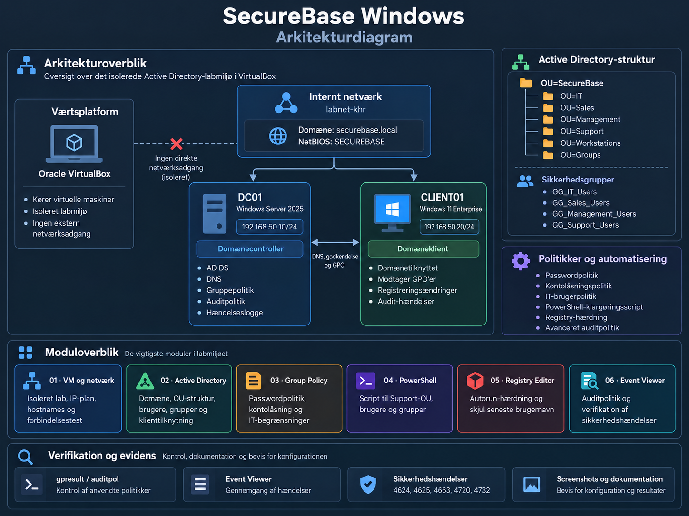

# SecureBase Windows

**Windows OS intro · September 2026**

## Design og drift af et lille Active Directory-miljø

Jeg har opbygget et isoleret Windows-lab med en domænecontroller og en klient. Afleveringen viser opsætning, sikkerhedsvalg og resultater fra netværk og Active Directory til automatisering og analyse af sikkerhedslogs.

> **Visuel aflevering**
>
> [Åbn den visuelle aflevering →](https://khr-spec.github.io/SecureBase-Windows/)
>
> Interaktiv præsentation af labarkitekturen, projektets seks moduler og udvalgte tekniske resultater.

[Arkitektur](#arkitektur) · [Moduler](#moduler) · [Billedbeviser](evidence/README.md) · [PowerShell-script](scripts/README.md)

## Arkitektur

Diagrammet viser det isolerede VirtualBox-lab, domænestrukturen, de centrale sikkerhedspolitikker og sammenhængen mellem projektets seks moduler.

## Moduler

| Modul | Arbejde og dokumentation |
|---|---|
| [01 · VM og netværk](docs/01-vm-netvaerk.md) | Isoleret labnet, IP-plan, hostnames og forbindelsestest |
| [02 · Active Directory](docs/02-active-directory.md) | Domæne, OU-struktur, brugere, grupper og klienttilknytning |
| [03 · Group Policy](docs/03-group-policy.md) | Password- og lockout-politik samt en målrettet brugerpolitik |
| [04 · PowerShell](docs/04-powershell.md) | Kommenteret script, brugeroprettelse og verificeret genkørsel |
| [05 · Registry Editor](docs/05-registry.md) | To sikkerhedsændringer med før/efter-kontrol og tilbageførsel |
| [06 · Event Viewer](docs/06-event-viewer.md) | Central audit, hændelsesanalyse og overvågningsbegrundelser |

## Labmiljø

| Maskine | System og funktion | IPv4 |
|---|---|---|
| **DC01** | Windows Server 2025 Standard Evaluation · AD DS, DNS og Global Catalog | `192.168.50.10/24` |
| **CLIENT01** | Windows 11 Enterprise Evaluation · domæneklient | `192.168.50.20/24` |

**Domæne:** `securebase.local` · **NetBIOS:** `SECUREBASE`
**Netværk:** VirtualBox Internal Network · `labnet-khr`

## Dokumentation og kode

Hvert modul samler fremgangsmåde, sikkerhedsbegrundelser og testresultater. De centrale screenshots vises i teksten; alle **85 billedbeviser** kan åbnes fra de tilhørende oversigter.

[Se alle billedbeviser →](evidence/README.md)
[Læs scriptet og kørselsvejledningen →](scripts/README.md)
[Se Event ID-oversigten →](docs/06-event-viewer.md#event-id-oversigt)

---

*SecureBase Windows · Afleveringsudgave 1.1*
