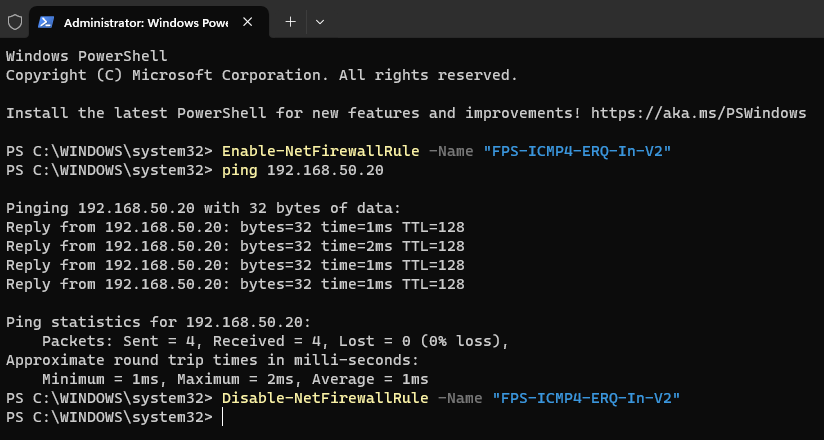
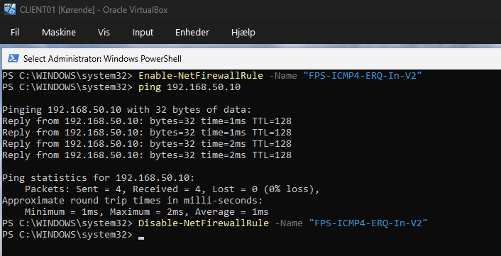

# Modul 1: VM-opsætning og netværk

[Overblik](../README.md) · [Billedbeviser](../evidence/01-vm-netvaerk/README.md) · [Modul 2 →](02-active-directory.md)

> **DC01 og CLIENT01** · Isoleret netværk med faste adresser og verificeret forbindelse.

## Formål

At etablere et kontrolleret VirtualBox-lab, hvor Windows Server og Windows-klienten kan kommunikere på et separat internt netværk.

## Udførte opgaver

DC01 blev installeret med **Windows Server 2025 Standard Evaluation, Desktop Experience**, og CLIENT01 med **Windows 11 Enterprise Evaluation**. Begge maskiner blev tilsluttet Internal Network **`labnet-khr`**, omdøbt i Windows og konfigureret med følgende adresser:

| Maskine | IPv4 | Subnetmaske | DNS | Gateway |
|---|---|---|---|---|
| DC01 | `192.168.50.10` | `255.255.255.0` | `192.168.50.10` | Ingen |
| CLIENT01 | `192.168.50.20` | `255.255.255.0` | `192.168.50.10` | Ingen |

Windows-netværksprofilen blev sat til **Private** på begge maskiner. DNS-adressen blev forberedt til DC01; DNS-serverrollen installeres i [Modul 2](02-active-directory.md).

### Forbindelsestest

Windows’ indbyggede ICMPv4-regel blev aktiveret til testen og deaktiveret igen efter fire svar uden pakketab i hver retning:

```powershell
# På begge VM’er: midlertidig tilladelse til indgående ping.
Enable-NetFirewallRule -Name "FPS-ICMP4-ERQ-In-V2"

# På DC01:
ping 192.168.50.20

# På CLIENT01:
ping 192.168.50.10

# På begge VM’er efter testen:
Disable-NetFirewallRule -Name "FPS-ICMP4-ERQ-In-V2"
```

`hostname` viste **DC01** og **CLIENT01**. `Get-Service VBoxService` viste Guest Additions-tjenesten som **Running** på begge VM’er.

## Sikkerhedsmæssig begrundelse

Internal Network adskiller labbet fra de øvrige netværk. De statiske adresser gør serveren forudsigelig som kommende domæne- og DNS-server, mens klienten får ét fast sted at foretage domæneopslag.

Windows Firewall forblev aktiv. Ping blev tilladt som en afgrænset test, ikke gennem permanent åbning af hele fil- og printerdelingen. Der blev ikke konfigureret DHCP eller en router på det interne segment; derfor er gateway-feltet tomt.

## Dokumentation / bevis

| Kontrol | Resultat | Billede |
|---|---|---|
| IP og DNS | Adresser som i IP-planen | [DC01](../evidence/01-vm-netvaerk/01-dc01-ipv4.png) · [CLIENT01](../evidence/01-vm-netvaerk/02-client01-ipv4.png) |
| Netværkstest | 4/4 svar og 0 % pakketab begge veje | [Fra DC01](../evidence/01-vm-netvaerk/03-dc01-ping-og-oprydning.png) · [Fra CLIENT01](../evidence/01-vm-netvaerk/04-client01-ping-og-oprydning.png) |
| Hostnames | `DC01` og `CLIENT01` | [Server](../evidence/01-vm-netvaerk/06-dc01-hostname.png) · [Klient](../evidence/01-vm-netvaerk/07-client01-hostname.png) |
| VirtualBox-netværk | `labnet-khr` på begge VM’er | [Server](../evidence/01-vm-netvaerk/08-dc01-internal-network.png) · [Klient](../evidence/01-vm-netvaerk/09-client01-internal-network.png) |
| Guest Additions | `VBoxService`: Running | [Server](../evidence/01-vm-netvaerk/10-dc01-guest-additions.png) · [Klient](../evidence/01-vm-netvaerk/11-client01-guest-additions.png) |

### Ping i begge retninger



*DC01 → CLIENT01: fire svar og efterfølgende deaktivering af testreglen.*



*CLIENT01 → DC01: fire svar og 0 % pakketab.*

## Overvejelser og fravalg

Under fejlsøgningen blev en bred regelgruppe og en brugerdefineret ICMP-regel afprøvet og rullet tilbage ved en firewallnulstilling. Den afsluttende test brugte den indbyggede pingregel. [Opslaget efter den tidligere brugerdefinerede regel](../evidence/01-vm-netvaerk/05-custom-firewallregel-fravaerende.png) gav ingen resultater.

Forløbet viser forskellen mellem at være på samme netværk og at tillade en bestemt trafiktype. DNS og domænefunktion kontrolleres særskilt i næste modul.

## Resultat

Begge VM’er har dokumenterede navne, netværksindstillinger og aktive Guest Additions. Forbindelsen er testet i begge retninger, og den midlertidige pingregel er deaktiveret efter testen.

---

[← Overblik](../README.md) · [Alle 11 billeder](../evidence/01-vm-netvaerk/README.md) · [Modul 2 →](02-active-directory.md)
