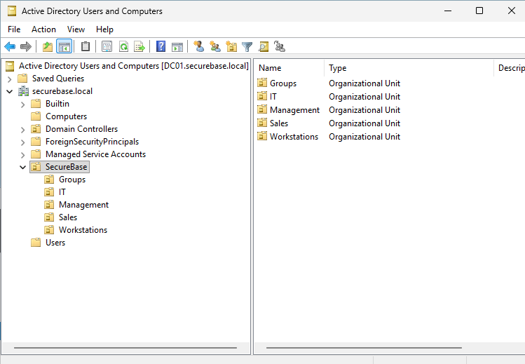
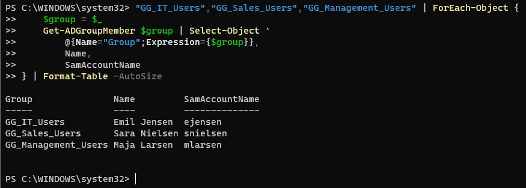
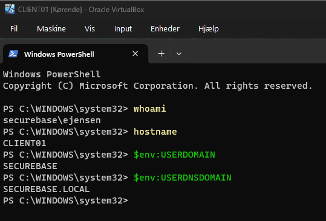

# Modul 2: Active Directory

[Overblik](../README.md) · [← Modul 1](01-vm-netvaerk.md) · [Billedbeviser](../evidence/02-active-directory/README.md) · [Modul 3 →](03-group-policy.md)

> **DC01 og CLIENT01** · Domæne, afdelingsstruktur og verificeret domænelogin.

## Formål

At etablere DC01 som domænecontroller og DNS-server, organisere brugere og grupper samt tilknytte CLIENT01 til domænet.

## Udførte opgaver

AD DS blev installeret på DC01, som derefter blev promoveret til den første domænecontroller i en ny forest.

| Indstilling | Valg |
|---|---|
| Domæne og forest | `securebase.local` |
| NetBIOS-navn | `SECUREBASE` |
| Domænecontroller | `DC01.securebase.local` |
| Forest- og domain-functional level | Windows Server 2025 |
| DNS Server og Global Catalog | Aktiveret på DC01 |
| RODC og DNS delegation | Ikke valgt |
| AD-database og logfiler | `C:\WINDOWS\NTDS` |
| SYSVOL | `C:\WINDOWS\SYSVOL` |

Prerequisite check bestod. Efter genstart blev domænet og foresten kontrolleret med `Get-ADDomain` og `Get-ADForest`; `Get-Service NTDS,DNS` viste begge tjenester som **Running**.

### OU’er, brugere og grupper

```text
securebase.local
└── SecureBase
    ├── IT
    │   └── Emil Jensen (ejensen)
    ├── Sales
    │   └── Sara Nielsen (snielsen)
    ├── Management
    │   └── Maja Larsen (mlarsen)
    ├── Groups
    │   ├── GG_IT_Users
    │   ├── GG_Sales_Users
    │   └── GG_Management_Users
    └── Workstations
        └── CLIENT01
```

Strukturen viser afslutningen af Modul 2. Support-afdelingen tilføjes med PowerShell i [Modul 4](04-powershell.md).

| OU | Bruger / objekt | Gruppe | Begrundelse |
|---|---|---|---|
| IT | Emil Jensen (`ejensen`) | `GG_IT_Users` | Samler IT-brugere til afdelingsmedlemskab og brugerpolitikker. |
| Sales | Sara Nielsen (`snielsen`) | `GG_Sales_Users` | Adskiller salgsafdelingens brugere. |
| Management | Maja Larsen (`mlarsen`) | `GG_Management_Users` | Adskiller ledelsens brugere. |
| Groups | De tre globale sikkerhedsgrupper | — | Samler grupperne til administration og senere adgangstildeling. |
| Workstations | CLIENT01 | — | Samler klientobjekter til computerpolitikker. |

### Klienttilknytning

CLIENT01 brugte DC01 som DNS-server. Forward-opslag og LDAP SRV-recorden blev kontrolleret, før klienten blev tilknyttet `securebase.local` og genstartet. Login som `SECUREBASE\ejensen` blev verificeret, og computerobjektet blev flyttet fra `Computers` til `SecureBase\Workstations`.

## Sikkerhedsmæssig begrundelse

Navngivne konti understøtter sporbarhed, mens afdelingsgrupperne danner grundlag for adgangstildeling via medlemskab. OU’erne organiserer objekterne til administration og senere politikstyring; selve placeringen i en OU tildeler ikke afdelingsrettigheder.

DNS blev kontrolleret før domænetilknytningen, så klientens evne til at finde DC01 kunne vurderes uafhængigt af selve loginforsøget.

## Dokumentation / bevis

| Kontrol | Resultat | Billede |
|---|---|---|
| Promotion | Prerequisite check bestået | [Kontrol før installation](../evidence/02-active-directory/07-prerequisites-passed.png) |
| Domæne og tjenester | `securebase.local`; DNS og NTDS Running | [Domæne, forest og tjenester](../evidence/02-active-directory/09-domain-forest-services.png) |
| Brugere | Én bruger i hver afdeling | [IT](../evidence/02-active-directory/13-user-emil-it.png) · [Sales](../evidence/02-active-directory/14-user-sara-sales.png) · [Management](../evidence/02-active-directory/15-user-maja-management.png) |
| DNS | DC01 og domænet returnerer `192.168.50.10` | [Forward-opslag](../evidence/02-active-directory/16-client-dns-lookups.png) |
| AD-SRV | LDAP peger på DC01, port 389 | [SRV-opslag](../evidence/02-active-directory/17-ad-srv-record.png) |
| Computerobjekt | CLIENT01 i Workstations | [Placering i ADUC](../evidence/02-active-directory/20-client01-workstations-ou.png) |

### Struktur og medlemskaber



*De tre afdelings-OU’er samt Groups og Workstations under SecureBase.*



*Hver bruger er medlem af sin afdelingsgruppe.*

### Domænelogin



*`whoami` viser `securebase\ejensen`; hostname og domænevariabler peger på CLIENT01 og SECUREBASE.*

## Overvejelser og fravalg

Én forest, ét domæne og standardstierne for NTDS/SYSVOL var tilstrækkelige til labbet. DC01 skulle være skrivbar, så RODC blev fravalgt. DNS-delegation blev ikke oprettet i den nye isolerede forest.

`nslookup` viste en indledende timeout og `Server: Unknown`, men returnerede de forventede adresser. Det efterfølgende SRV-opslag og domænelogin lykkedes; årsagen til den indledende besked blev ikke fastslået.

## Resultat

DC01 fungerer som domænecontroller med DNS og Global Catalog. Afdelinger, brugere og gruppemedlemskaber er oprettet, og CLIENT01 er tilknyttet domænet med dokumenteret brugerlogin.

---

[← Modul 1](01-vm-netvaerk.md) · [Alle 22 billeder](../evidence/02-active-directory/README.md) · [Modul 3 →](03-group-policy.md)
