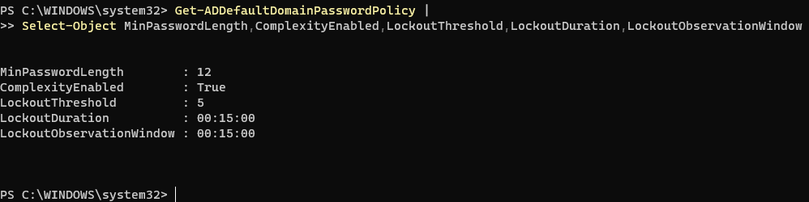
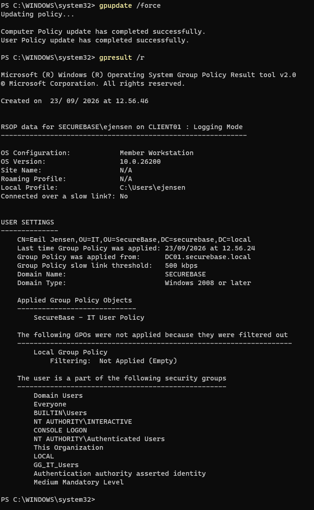
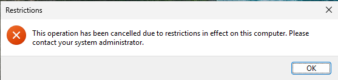

# Modul 3: Group Policy

[Overblik](../README.md) · [← Modul 2](02-active-directory.md) · [Modul 4 →](04-powershell.md)

> **Gennemført og dokumenteret** · DC01 og CLIENT01

## Formål

At håndhæve centrale indstillinger med Group Policy og dokumentere både den konfigurerede politik og dens effekt på domænet eller klienten.

## Udførte opgaver

To GPO’er blev oprettet på DC01: en domænepolitik til password og lockout samt en brugerpolitik, der giver en synlig effekt for IT-brugeren Emil Jensen på CLIENT01.

### GPO’er og placering

| GPO | Link | Formål |
|---|---|---|
| `SecureBase - Domain Account Policy` | `securebase.local` · Link Order 1 | Password- og account-lockout-politik |
| `SecureBase - IT User Policy` | `SecureBase/IT` | Blokering af Run-dialogen for IT-brugere |

`Default Domain Policy` har Link Order 2 på domæneroden. `Enforced` er ikke aktiveret for projektets GPO’er.

### Konfigurerede indstillinger

| Indstilling | Værdi |
|---|---|
| Minimum password length | 12 tegn |
| Password must meet complexity requirements | Enabled |
| Account lockout threshold | 5 fejlede loginforsøg |
| Account lockout duration | 15 minutter |
| Reset account lockout counter after | 15 minutter |
| Allow Administrator account lockout | Disabled |
| Remove Run menu from Start Menu | Enabled i IT-brugerpolitikken |

De øvrige passwordindstillinger blev efterladt som **Not Defined i den nye GPO**. Det angiver denne GPO’s konfiguration, ikke nødvendigvis de samlede effektive værdier fra alle politikker.

## Sikkerhedsmæssig begrundelse

**Password og lockout.** Kravene blev valgt for at begrænse brugen af korte passwords og gentagne online passwordgæt. 5 forsøg og 15 minutters lockout/reset giver en enkel politik, som kan beskrives og kontrolleres i labbet.

**Administratorindstillingen.** `Allow Administrator account lockout` blev sat til Disabled som et labvalg. Formålet var at begrænse risikoen for administrativ udelukkelse under senere kontrollerede tests. Screenshotet dokumenterer indstillingen; der er ikke her udført en særskilt funktionstest af Administrator-kontoens lockout-adfærd.

**Målrettet brugerpolitik.** IT-politikken blev linket til IT-OU’en i stedet for hele domænet. Emil Jensen ligger i denne OU, og effekten blev testet på hans session. Run-restriktionen er valgt som en synlig demonstration af policy-anvendelse, ikke som dokumentation for generel blokering af programkørsel.

## Dokumentation / bevis

### Effektiv domænepolitik

På DC01 blev følgende kontrol brugt:

```powershell
Get-ADDefaultDomainPasswordPolicy |
Select-Object MinPasswordLength,ComplexityEnabled,LockoutThreshold,LockoutDuration,LockoutObservationWindow
```



*Resultatet viser 12 tegn, complexity True, threshold 5 og 15 minutters lockout/observationsvindue. Denne kontrol viser ikke feltet Allow Administrator account lockout.*

### Klienttest som Emil Jensen

På CLIENT01, logget ind som `SECUREBASE\ejensen`:

```powershell
gpupdate /force
gpresult /r
```

`gpupdate` meldte gennemført opdatering. `gpresult /r` viste **SecureBase - IT User Policy** under *Applied Group Policy Objects* for Emil Jensen i IT-OU’en.



*Brugerdelen af gpresult på CLIENT01. Domænets passwordpolitik er verificeret særskilt ovenfor.*



*Forsøg på at åbne Run viste en restrictions-besked. Det er det synlige klientbevis.*

### Indstillinger og GPO-links

| Bevis | Dokumenterer |
|---|---|
| [Password Policy](../evidence/03-group-policy/03-password-policy.png) | 12 tegn og complexity Enabled |
| [Account Lockout Policy](../evidence/03-group-policy/04-lockout-policy.png) | De fire konfigurerede lockout-indstillinger |
| [IT-politikkens indstilling](../evidence/03-group-policy/06-remove-run-enabled.png) | Remove Run menu from Start Menu = Enabled |
| [Link Order på domæneroden](../evidence/03-group-policy/10-domain-gpo-link-order.png) | Domain Account Policy foran Default Domain Policy |
| [Group Policy Inheritance i IT](../evidence/03-group-policy/11-it-gpo-inheritance.png) | Lokal IT-policy og nedarvede domænepolitikker |

[Åbn hele bevisoversigten — 11 screenshots →](../evidence/03-group-policy/README.md)

## Overvejelser og fravalg

**Prioritet.** Den første effektive kontrol viste stadig minimumslængde 7 og lockout-threshold 0. Domain Account Policy blev flyttet til Link Order 1, og computerpolitikken blev genindlæst på DC01. Den efterfølgende kontrol viste de ønskede værdier. Forløbet viser, hvorfor et screenshot af editoren ikke kan stå alene.

**Ingen ekstra filshare.** En wallpaper-politik blev fravalgt, fordi Run-restriktionen kunne demonstreres uden en ekstra billedfil eller netværkssti. Der blev ikke tilføjet Enforced eller ændret direkte i Default Domain Policy.

**Testafgrænsning.** IT-politikkens effekt er vist for Emil. Der er ikke et separat sammenligningslogin fra Sales eller Management i dette modul. Der er heller ikke dokumenteret, at alle eksisterende passwords er blevet ændret til mindst 12 tegn; ændringen af passwordpolitikken skal ikke læses som et sådant bevis.

## Status

- [x] Password- og account-lockout-politik konfigureret.
- [x] Effektive værdier kontrolleret med Get-ADDefaultDomainPasswordPolicy.
- [x] Synlig IT-brugerpolitik oprettet og linket.
- [x] gpupdate gennemført på CLIENT01.
- [x] gpresult /r og den synlige Run-restriktion dokumenteret.
- [x] GPO-indstillinger, linkprioritet og inheritance dokumenteret.

**Modul 3 er gennemført og dokumenteret.**

---

[Overblik](../README.md) · [← Modul 2](02-active-directory.md) · [Modul 4 →](04-powershell.md)
