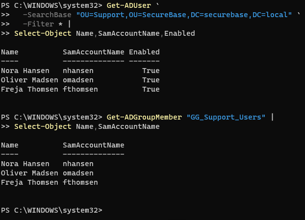
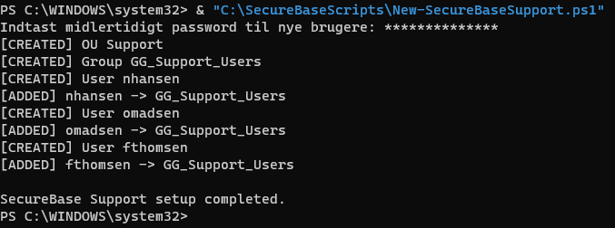
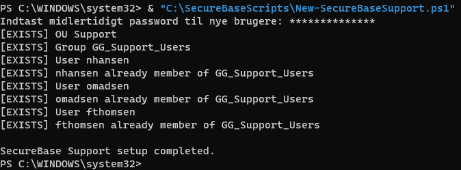

# Modul 4: Command Line og PowerShell

[Overblik](../README.md) · [← Modul 3](03-group-policy.md) · [Modul 5 →](05-registry.md)

> **Gennemført og dokumenteret** · DC01

## Formål

At automatisere oprettelse af AD-objekter med PowerShell og dokumentere, at scriptet både opretter den ønskede struktur og håndterer en efterfølgende genkørsel.

## Udførte opgaver

Det kommenterede script **New-SecureBaseSupport.ps1** blev gemt på DC01. Syntaksen blev kontrolleret med PowerShell-parseren, og de eksisterende SecureBase- og Groups-OU’er blev verificeret før første kørsel.

Scriptet oprettede følgende:

| Objekt | Placering / medlemskab |
|---|---|
| Support-OU | Under `SecureBase` |
| `GG_Support_Users` | Global sikkerhedsgruppe i `SecureBase/Groups` |
| Nora Hansen (`nhansen`) | I Support, medlem af `GG_Support_Users` |
| Oliver Madsen (`omadsen`) | I Support, medlem af `GG_Support_Users` |
| Freja Thomsen (`fthomsen`) | I Support, medlem af `GG_Support_Users` |

Resultatet blev kontrolleret med Get-ADUser, Get-ADGroupMember og ADUC. Derefter blev samme script kørt igen; alle objekter og medlemskaber blev rapporteret som eksisterende.

### Script og kørsel

[Åbn det fulde kommenterede script og kørselsvejledningen →](../scripts/README.md)

Den faktisk anvendte kommando på DC01 var:

```powershell
& "C:\SecureBaseScripts\New-SecureBaseSupport.ps1"
```

Scriptet kræver ActiveDirectory-modulet, rettigheder til oprettelsen samt de eksisterende SecureBase- og Groups-OU’er. Det spørger efter et midlertidigt password som SecureString; passwordet er ikke hardcoded i filen. Nye konti oprettes med krav om passwordskift ved næste login.

## Sikkerhedsmæssig begrundelse

**Reproducerbar oprettelse.** Brugerne defineres i én liste, og samme løkke opretter deres egenskaber og medlemskaber. Det mindsker behovet for gentagne manuelle klik.

**Kontrol før oprettelse.** OU, gruppe, brugere og gruppemedlemskaber slås op før ændringen. Den dokumenterede genkørsel viser, at de eksisterende objekter blev genbrugt frem for oprettet igen.

**Adskilt scope.** Support blev valgt som en ny afdeling. De manuelt oprettede IT-, Sales- og Management-objekter fra Modul 2 blev ikke ændret af dette forløb. Sikkerhedsgruppen bruges til afdelingsmedlemskab; der tildeles ikke administratorrettigheder i scriptet.

**Passwordhåndtering.** Passwordet læses interaktivt og vises ikke i klartekst i de gemte kørselsbilleder. Denne dokumentation indeholder ikke passwordværdien.

## Dokumentation / bevis

### Verifikationskommandoer

```powershell
Get-ADUser `
  -SearchBase "OU=Support,OU=SecureBase,DC=securebase,DC=local" `
  -Filter * |
Select-Object Name,SamAccountName,Enabled

Get-ADGroupMember "GG_Support_Users" |
Select-Object Name,SamAccountName
```



*Get-ADUser viser de tre konti med Enabled = True. Get-ADGroupMember viser de samme tre medlemmer af Support-gruppen.*

### Første kørsel og genkørsel



*Første kørsel: CREATED for OU, gruppe og brugere; ADDED for gruppemedlemskaberne.*



*Anden kørsel: EXISTS for de samme objekter og medlemskaber. Det indtastede password blev ikke brugt til at ændre de eksisterende brugeres passwords i denne kodevej.*

### Supplerende beviser

| Bevis | Indhold |
|---|---|
| [Før-billede i ADUC](../evidence/04-powershell/01-before-support-ou.png) | Support-OU’en er endnu ikke oprettet |
| [Syntaks og forudsætninger](../evidence/04-powershell/02-syntax-prerequisites.png) | Ingen parserfejl; SecureBase- og Groups-OU’erne findes |
| [Support i ADUC](../evidence/04-powershell/06-support-ou-users.png) | Nora, Oliver og Freja i Support-OU’en |
| [Grupper i ADUC](../evidence/04-powershell/07-support-group.png) | GG_Support_Users sammen med de tre tidligere grupper |

[Åbn hele bevisoversigten — 7 screenshots →](../evidence/04-powershell/README.md)

## Overvejelser og fravalg

Scriptet er holdt som en læsbar labopgave frem for et generelt provisioning-system. Den fulde kildefil er bevaret sammen med kørselsvejledning og resultatbeviser.

**Afgrænsning af genkørselstesten.** Testen dækker det dokumenterede lab, hvor objekterne først oprettes og derefter findes igen. Den er ikke en test af alle fejlscenarier, eksempelvis manglende AD-forbindelse eller utilstrækkelige rettigheder. Scriptet spørger fortsat efter et password ved genkørsel, selv når alle tre brugere allerede findes.

## Status

- [x] En OU oprettet med New-ADOrganizationalUnit.
- [x] Tre brugere oprettet med New-ADUser.
- [x] En gruppe oprettet med New-ADGroup.
- [x] Medlemskaber tilføjet med Add-ADGroupMember.
- [x] Get-ADUser og Get-ADGroupMember-output dokumenteret.
- [x] Kontrol af eksisterende objekter demonstreret ved anden kørsel.
- [x] Fuldt kommenteret script og kørselsvejledning inkluderet.

**Modul 4 er gennemført og dokumenteret.**

---

[Overblik](../README.md) · [← Modul 3](03-group-policy.md) · [Modul 5 →](05-registry.md)
