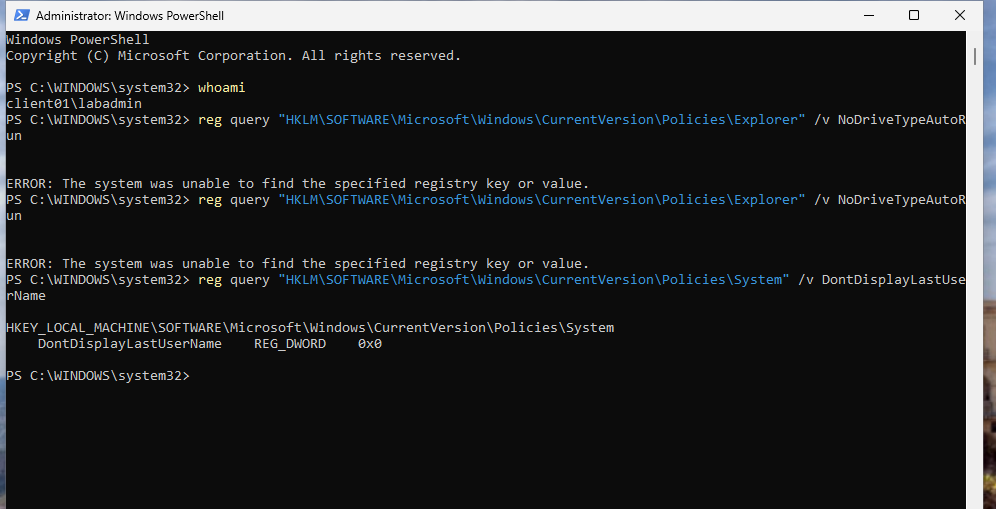
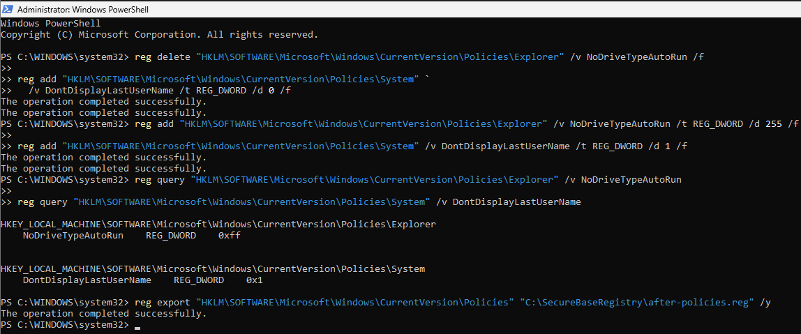
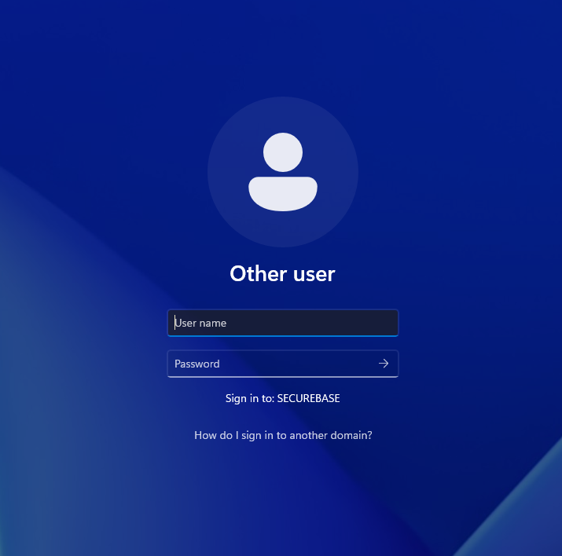

# Modul 5: Registry Editor

[Overblik](../README.md) · [← Modul 4](04-powershell.md) · [Billedbeviser](../evidence/05-registry/README.md) · [Modul 6 →](06-event-viewer.md)

> **CLIENT01 · 23. september 2026** · To sikkerhedsændringer med før/efter-kontrol og tilbageførsel.

## Formål

At foretage begrundede ændringer i Windows Registry og dokumentere udgangspunkt, resultat og en præcis metode til tilbageførsel.

## Udførte opgaver

Arbejdet blev udført som `CLIENT01\labadmin` med administratorrettigheder. Policies-grenen blev eksporteret, før værdierne blev ændret manuelt i Registry Editor.

| Værdi | Type | Før | Endelig værdi |
|---|---|---|---|
| `NoDriveTypeAutoRun` | `REG_DWORD` | Ikke fundet ved opslaget | `0xff` / 255 |
| `DontDisplayLastUserName` | `REG_DWORD` | `0x0` | `0x1` |

**AutoRun-relateret mediepolitik:** `NoDriveTypeAutoRun` blev oprettet som DWORD (32-bit) med hexadecimalværdien **ff** under:

```text
HKLM\SOFTWARE\Microsoft\Windows\CurrentVersion\Policies\Explorer
```

**Skjul seneste brugernavn:** `DontDisplayLastUserName` blev ændret fra **0** til **1** under:

```text
HKLM\SOFTWARE\Microsoft\Windows\CurrentVersion\Policies\System
```

Begge værdier blev kontrolleret med `reg query`. Login-skærmen blev testet efter log af. Tilbageførslen blev derefter afprøvet, hvorefter de ønskede slutværdier blev genskabt og efter-eksporten opdateret.

## Sikkerhedsmæssig begrundelse

`NoDriveTypeAutoRun=0xff` vælger alle drevtyper i den AutoRun-relaterede mediepolitik, som Microsoft beskriver under *Turn off AutoPlay*. Formålet er at begrænse automatisk behandling af indsatte medier. Kontrollen her er på registry-niveau; der blev ikke udført en særskilt test med eksternt medie. [Microsoft: indstillingen](https://learn.microsoft.com/en-us/troubleshoot/windows-client/shell-experience/issues-autoplay-disabled-group-policy).

`DontDisplayLastUserName=1` reducerer synligheden af kontonavne på login-skærmen. Det supplerer password- og adgangskontrollen. [Microsoft: loginpolitikken](https://learn.microsoft.com/en-us/previous-versions/windows/it-pro/windows-10/security/threat-protection/security-policy-settings/interactive-logon-do-not-display-last-user-name).

Ændringerne blev begrænset til to værdier på CLIENT01. Før-eksport og efterfølgende opslag gjorde det muligt at sammenligne de konkrete indstillinger.

## Dokumentation / bevis

### Før-tilstand



*NoDriveTypeAutoRun blev ikke fundet ved opslaget. DontDisplayLastUserName var DWORD 0x0.*

### Før- og efter-eksport

Filerne blev oprettet på CLIENT01 i `C:\SecureBaseRegistry`. Eksportkommandoerne og de relevante værdier dokumenteres med screenshots.

```powershell
# Udført før ændringerne; før-eksporten blev derefter bevaret.
reg export "HKLM\SOFTWARE\Microsoft\Windows\CurrentVersion\Policies" "C:\SecureBaseRegistry\before-policies.reg" /y

# Udført efter ændringerne og gentaget efter genoprettelsen.
reg export "HKLM\SOFTWARE\Microsoft\Windows\CurrentVersion\Policies" "C:\SecureBaseRegistry\after-policies.reg" /y
```

`/y` tillader overskrivning af eksportfilen. Før-eksporten skal derfor bevares, når ændringerne først er foretaget. [Microsoft: reg export](https://learn.microsoft.com/en-us/windows-server/administration/windows-commands/reg-export).

[Før-eksport](../evidence/05-registry/02-registry-foer-eksport.png) · [Begge eksportfiler](../evidence/05-registry/05-vaerdier-og-efter-eksport.png)

### Verificeret sluttilstand

```powershell
reg query "HKLM\SOFTWARE\Microsoft\Windows\CurrentVersion\Policies\Explorer" /v NoDriveTypeAutoRun
reg query "HKLM\SOFTWARE\Microsoft\Windows\CurrentVersion\Policies\System" /v DontDisplayLastUserName
```

```text
NoDriveTypeAutoRun         REG_DWORD    0xff
DontDisplayLastUserName    REG_DWORD    0x1
```



*Efter tilbageførslen blev 0xff og 0x1 genskabt, læst tilbage og eksporteret.*

### Synlig effekt



*Other user vises med tomt brugernavnsfelt. Domænenavnet SECUREBASE er fortsat synligt.*

Loginbilledet er fra testen før tilbageførslen. Den efterfølgende genoprettelse blev verificeret med registry-opslagene ovenfor.

## Overvejelser og fravalg

### Risiko og tilbageførsel

En forkert nøgle, datatype eller talbase kan ændre andre forhold end tilsigtet. Her svarer **ff** i hexadecimal til **255** i decimal. Hele Policies-grenen blev eksporteret, men tilbageførslen blev begrænset til de to værdier for at undgå at påvirke andre indstillinger.

> **Tilbageførsel — ikke den ønskede sluttilstand.** Kommandoerne nedenfor blev afprøvet under testen. Den afleverede konfiguration er **0xff og 0x1**.

```powershell
# Fjern kun den værdi, som blev tilføjet i dette modul.
reg delete "HKLM\SOFTWARE\Microsoft\Windows\CurrentVersion\Policies\Explorer" /v NoDriveTypeAutoRun /f

# Gendan den tidligere værdi for visning af brugernavn.
reg add "HKLM\SOFTWARE\Microsoft\Windows\CurrentVersion\Policies\System" /v DontDisplayLastUserName /t REG_DWORD /d 0 /f
```

Begge kommandoer meldte succes. Derefter blev hærdningen genskabt, og slutværdierne blev læst tilbage. [Tilbageførselsbevis](../evidence/05-registry/07-rollback-kommandoer.png).

En import af før-eksporten fjerner ikke automatisk værdier, der først er oprettet senere. Derfor blev den nye værdi slettet specifikt med `/v`, mens Explorer- og System-nøglerne blev bevaret. [Microsoft: reg import](https://learn.microsoft.com/en-us/windows-server/administration/windows-commands/reg-import) · [reg delete](https://learn.microsoft.com/en-us/windows-server/administration/windows-commands/reg-delete).

## Resultat

De to ændringer er dokumenteret med før-/efterværdier, eksportkommandoer, en synlig logintest og tilbageførsel. CLIENT01 er efterladt med `NoDriveTypeAutoRun=0xff` og `DontDisplayLastUserName=0x1`.

---

[← Modul 4](04-powershell.md) · [Alle 8 billeder](../evidence/05-registry/README.md) · [Modul 6 →](06-event-viewer.md)
