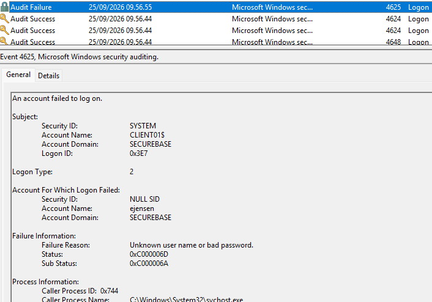
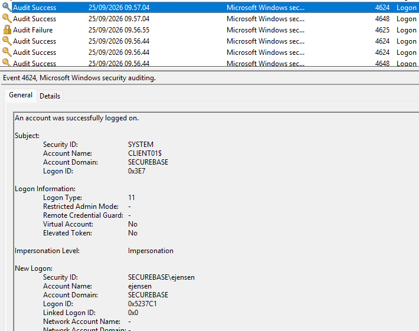
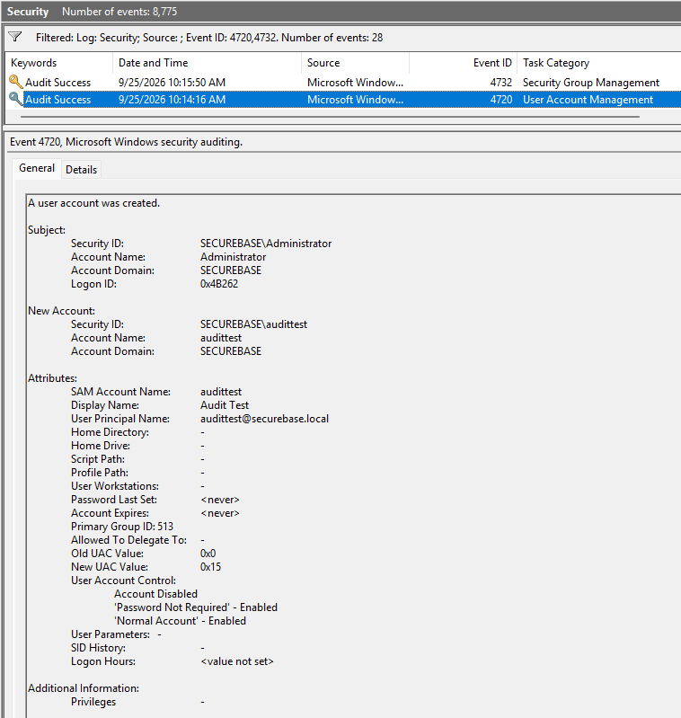
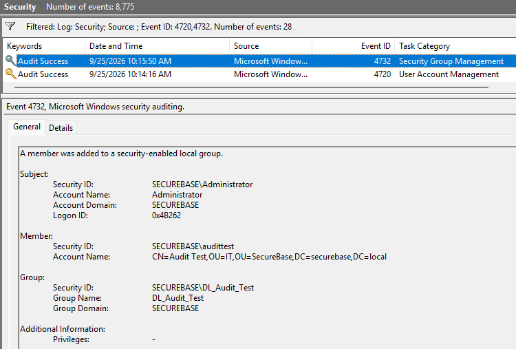
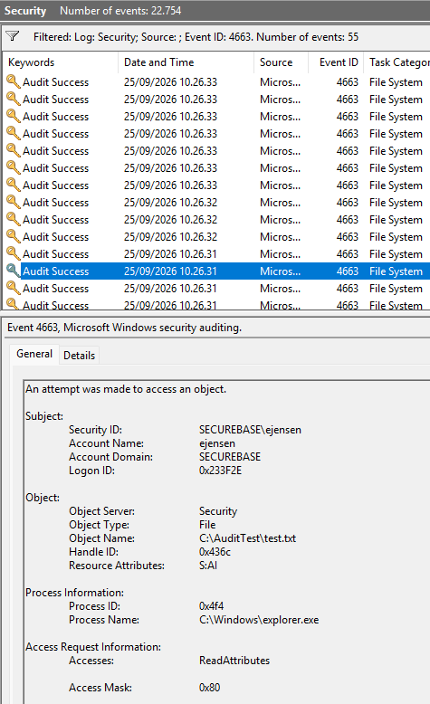

# Modul 6: Event Viewer og logning

[Overblik](../README.md) · [← Modul 5](05-registry.md) · [Billedbeviser](../evidence/06-event-viewer/README.md)

> **Gennemført og dokumenteret** · DC01 og CLIENT01 · 25. september 2026  
> Central audit-konfiguration, kontrollerede hændelser og efterfølgende oprydning.

## Formål

At konfigurere audit-logning, identificere konkrete sikkerhedshændelser og forklare, hvad de viser om login, kontoændringer, gruppemedlemskab og adgang til en fil. Opgavens fire angivne Event ID’er — **4624, 4625, 4720 og 4732** — er dokumenteret. Filadgang med **4663** indgår som supplerende test af objektadgang.

## Udførte opgaver

### Central audit-GPO

`SecureBase - Audit Policy` blev oprettet og linket til domæneroden `securebase.local`. Indstillingerne blev konfigureret under:

```text
Computer Configuration
└── Policies
    └── Windows Settings
        └── Security Settings
            └── Advanced Audit Policy Configuration
                └── Audit Policies
```

| Kategori | Underkategori | Konfigureret audit |
|---|---|---|
| Logon/Logoff | Audit Logon | Success and Failure |
| Account Management | Audit User Account Management | Success |
| Account Management | Audit Security Group Management | Success |
| Object Access | Audit File System | Success and Failure |

De effektive værdier blev kontrolleret på begge maskiner. På CLIENT01 stod File System først som **No Auditing**. Efter en ny computerpolitik-opdatering viste `gpresult` audit-GPO’en som anvendt, og `auditpol` viste **Success and Failure**. Der blev ikke brugt en lokal `auditpol /set`-ændring som erstatning for GPO’en.

### Kontrollerede testhandlinger

| Maskine | Handling | Observeret hændelse |
|---|---|---|
| CLIENT01 | Ét bevidst forkert password for ejensen | 4625 · mislykket interaktivt login |
| CLIENT01 | Efterfølgende vellykket login for ejensen | 4624 · Logon Type 11, CachedInteractive |
| DC01 | Oprettelse af Audit Test / audittest i IT | 4720 · ny konto |
| DC01 | audittest tilføjet til DL_Audit_Test | 4732 · nyt medlem af domain-local sikkerhedsgruppe |
| CLIENT01 | Testfil åbnet; auditeret adgang registreret | 4663 · ReadAttributes på test.txt |

`DL_Audit_Test` blev valgt som **Domain local / Security**. Der blev ikke tildelt administratorrettigheder til gruppen som en del af testen. De eksisterende `GG_*`-grupper blev ikke ændret for at frembringe den nye hændelse.

### Filtest med SACL

På CLIENT01 blev `C:\AuditTest\test.txt` oprettet med indholdet **SecureBase audit test**. I filens **Security → Advanced → Auditing** blev der konfigureret en audit-entry for Emil Jensen (`ejensen@securebase.local`): **Success**, med **Read** og **Read & execute** markeret.

En tidligere dialog viste auditing på mappen med *This folder only*. Den efterfølgende dokumenterede entry blev sat direkte på filen. Filen blev derefter åbnet i ejensen-sessionen, og Security-loggen blev undersøgt for 4663.

## Sikkerhedsmæssig begrundelse

**Central styring og efterprøvning.** GPO’en samler de valgte auditindstillinger. `gpresult` viser den anvendte GPO, mens `auditpol` viser den effektive auditkonfiguration. Ingen af de to står alene som bevis for, at en bestemt handling blev logget; det dokumenteres med selve hændelsen.

**Afgrænsede tests.** Det forkerte login blev begrænset til ét planlagt forsøg, da domænets dokumenterede lockout-grænse er fem. Konto- og gruppetesten brugte særskilte testobjekter, som blev slettet bagefter. SACL-testen var rettet mod ejensen og testfilen frem for at auditere hele klientens drev.

**Audit er ikke adgangstildeling.** File System-audit kræver både underkategorien og en passende audit-entry på objektet. SACL’en bestemmer, hvilke hændelser der skal logges; den er ikke en tildeling af læse- eller skriverettigheder i filens DACL. [Microsoft: Audit File System](https://learn.microsoft.com/en-us/previous-versions/windows/it-pro/windows-10/security/threat-protection/auditing/audit-file-system).

### Event ID-oversigt

Tabellen er en overvågningsbegrundelse, ikke en påstand om, at alle hændelser med disse ID’er er angreb.

| Event ID | Betydning | Hvorfor relevant at overvåge |
|---|---|---|
| **4624** | En logonsession er oprettet. Typefeltet skelner bl.a. mellem interaktivt login, unlock og cached login. | Sammenhold konto, maskine, tidspunkt og Logon Type med forventet brug. Et succes-event er ikke automatisk et online domænelogin. |
| **4625** | Et loginforsøg mislykkedes. | Gentagne fejl kan pege på passwordgæt eller kontoproblemer. Undersøg konto, fejlårsag og Status/SubStatus; et enkelt forkert password er ikke i sig selv et angreb. |
| **4720** | En brugerkonto blev oprettet. | Kontrollér hvem der oprettede kontoen, hvilken konto der blev oprettet, og om ændringen var forventet. Uventede konti kan give varig adgang. |
| **4732** | Et medlem blev føjet til en sikkerhedsaktiveret lokal/domain-local gruppe. | Kontrollér aktør, medlem og gruppe. Risikoen afhænger af gruppens faktiske rettigheder; testgruppen giver ikke i sig selv øgede rettigheder. |
| **4663** | En bestemt adgangsrettighed blev brugt på et auditeret objekt. | Sammenhold konto, objektsti, proces og Accesses. Metadataadgang, læsning af indhold og ændringer er forskellige handlinger. |

**Teknisk reference for begreberne:** Microsofts hændelsesbeskrivelser for [4624](https://learn.microsoft.com/en-us/previous-versions/windows/it-pro/windows-10/security/threat-protection/auditing/event-4624), [4625](https://learn.microsoft.com/en-us/previous-versions/windows/it-pro/windows-10/security/threat-protection/auditing/event-4625), [4720](https://learn.microsoft.com/en-us/previous-versions/windows/it-pro/windows-10/security/threat-protection/auditing/event-4720), [4732](https://learn.microsoft.com/en-us/previous-versions/windows/it-pro/windows-10/security/threat-protection/auditing/event-4732) og [4663](https://learn.microsoft.com/en-us/previous-versions/windows/it-pro/windows-10/security/threat-protection/auditing/event-4663). Labresultaterne nedenfor kommer fra de konkrete screenshots.

## Dokumentation / bevis

### 1. GPO anvendt og auditindstillinger kontrolleret

På DC01 og CLIENT01 blev computerpolitikken opdateret og kontrolleret. Security-log og auditkontrol blev tilgået med administratorrettigheder; login- og filtesten blev udført som ejensen.

```powershell
# På hver VM, i en PowerShell-session med administratorrettigheder.
gpupdate /target:computer /force
gpresult /scope computer /r

auditpol /get /subcategory:"Logon"
auditpol /get /subcategory:"User Account Management"
auditpol /get /subcategory:"Security Group Management"
auditpol /get /subcategory:"File System"
```

**Forkortet afskrift af de dokumenterede slutværdier:**

```text
Logon                       Success and Failure
User Account Management     Success
Security Group Management   Success
File System                 Success and Failure
```

| Bevis | Resultat |
|---|---|
| [DC01 — alle fire underkategorier](../evidence/06-event-viewer/06-dc01-effektiv-auditpolitik.png) | Alle fire værdier svarer til konfigurationen |
| [CLIENT01 — før genindlæsning](../evidence/06-event-viewer/07-client01-foer-gpupdate.png) | File System er endnu No Auditing; øvrige tre svarer til planen |
| [CLIENT01 — efter genindlæsning](../evidence/06-event-viewer/08-client01-gpo-og-file-system.png) | Audit-GPO er anvendt; File System er Success and Failure |
| [DC01 — afsluttende gpresult](../evidence/06-event-viewer/23-dc01-gpresult-slutkontrol.png) | SecureBase - Audit Policy findes under Applied Group Policy Objects |

Den første afvigelse er dokumenteret som et mellemtrin, ikke som slutkonfiguration. Den præcise årsag til, at CLIENT01 endnu ikke havde File System-indstillingen, blev ikke undersøgt yderligere, da opdateringen og efterkontrollen lykkedes.

### 2. Login — 4625 og 4624 på CLIENT01

I **Event Viewer → Windows Logs → Security → Filter Current Log** blev der søgt efter loginhændelserne og kontoen `ejensen`. Tiderne nedenfor er aflæst i VM’ernes visning den **25. september 2026**; der er ikke foretaget en særskilt tidszone- eller ursynkroniseringskontrol.



*4625 kl. 09:56:55: Account For Which Logon Failed er ejensen i SECUREBASE. Logon Type er 2, Status er 0xC000006D og SubStatus er 0xC000006A. Subject er SYSTEM/CLIENT01$, ikke den konto der blev forsøgt logget ind med.*

Fejlteksten er *Unknown user name or bad password*. SubStatus **0xC000006A** beskriver forkert password; det stemmer med den udførte test. [Microsoft: 4625 og fejlkoder](https://learn.microsoft.com/en-us/previous-versions/windows/it-pro/windows-10/security/threat-protection/auditing/event-4625).



*4624 kl. 09:57:04: New Logon er SECUREBASE\ejensen, Logon Type er 11, og Elevated Token er No.*

**Type 11 er CachedInteractive.** Det er en succesfuld logonsession, men netop denne hændelse dokumenterer brug af lokalt cachede domæneoplysninger, ikke en online passwordvalidering mod DC01. En særskilt hændelsesoversigt viser også **Type 7 (Unlock)** for samme konto. [Microsoft: 4624 og Logon Types](https://learn.microsoft.com/en-us/previous-versions/windows/it-pro/windows-10/security/threat-protection/auditing/event-4624).

Efterfølgende viste `nltest /dsgetdc:securebase.local` DC01 på `192.168.50.10`, og `Test-ComputerSecureChannel -Verbose` returnerede **True**. Det er et selvstændigt forbindelsesbevis på kontroltidspunktet; det ændrer ikke den tidligere logontypes betydning. [Åbn secure-channel-kontrollen](../evidence/06-event-viewer/12-client01-dc-og-secure-channel.png) · [Åbn Type 7/11-oversigten](../evidence/06-event-viewer/13-ejensen-logontyper.png).

**Supplerende observation:** 4648 ses i [loginlisten](../evidence/06-event-viewer/09-logon-eventoversigt.png). Det vedrører brug af eksplicit angivne legitimationsoplysninger og er ikke en erstatning for 4624-beviset. De fulde felter i 4648 blev ikke analyseret her. [Microsoft: 4648](https://learn.microsoft.com/en-us/previous-versions/windows/it-pro/windows-10/security/threat-protection/auditing/event-4648).

### 3. Konto og gruppemedlemskab — 4720 og 4732 på DC01

Efter oprettelsen af `audittest` og gruppemedlemskabet blev Security-loggen på DC01 filtreret på **4720,4732**.



*4720 kl. 10:14:16: Subject er SECUREBASE\Administrator. New Account er SECUREBASE\audittest, og UPN er audittest@securebase.local. Det dokumenterer kontoens oprettelse.*

De viste kontoflag er et øjebliksbillede i oprettelseshændelsen, ikke en efterfølgende kontrol af kontoens endelige aktiverings- eller passwordtilstand. Testkontoen blev ikke brugt som almindelig brugerkonto og er senere slettet.



*4732 kl. 10:15:50: Subject er SECUREBASE\Administrator, Member er audittest i SecureBase/IT, og Group Name er DL_Audit_Test. Hændelsen knytter dermed aktør, medlem og målgruppe sammen.*

Her er “local” i eventtitlen ikke en påstand om en lokal CLIENT01-gruppe. Testen vedrører den **Domain Local Security Group**, der blev oprettet i AD på DC01. [Gruppen i ADUC](../evidence/06-event-viewer/15-domain-local-testgruppe.png) · [Medlemskabet i ADUC](../evidence/06-event-viewer/16-testgruppe-medlem.png).

### 4. Filadgang — 4663 på CLIENT01

[SACL-dialogen på filen](../evidence/06-event-viewer/20-sacl-testfil.png) viser ejensen, Success og de valgte læsehandlinger. [Notepad-billedet](../evidence/06-event-viewer/21-testfil-aabnet.png) viser indholdet **SecureBase audit test**; billedet alene viser ikke kontoidentiteten. Konto og objekt kobles i den efterfølgende hændelse:



*4663 kl. 10:26:31: Subject er SECUREBASE\ejensen, Object Name er C:\AuditTest\test.txt, Process Name er C:\Windows\explorer.exe, og Accesses er ReadAttributes med Access Mask 0x80.*

**Det viste event beviser metadataadgang, ikke læsning af filens tekstindhold.** `ReadAttributes` betyder adgang til filattributter. Der er ikke dokumenteret et særskilt 4663-event med `ReadData`. Audit virker for den viste adgang, men der er heller ikke udført en kontrolleret afvist filadgangstest. Microsoft beskriver 4663 som faktisk brug af en rettighed og ikke som et Failure-event. [Microsoft: 4663 og adgangsmasker](https://learn.microsoft.com/en-us/previous-versions/windows/it-pro/windows-10/security/threat-protection/auditing/event-4663).

### 5. Oprydning og bevaret auditkonfiguration

Efter testen blev **Audit Test**, **DL_Audit_Test** og **C:\AuditTest** fjernet. Audit-GPO’en blev bevaret. De tre oprydningsbeviser er:

| Objekt | Dokumenteret afslutning | Bevis |
|---|---|---|
| Audit Test | Den opdaterede IT-visning viser Emil Jensen uden testbrugeren | [IT-OU](../evidence/06-event-viewer/24-oprydning-it-ou.png) |
| DL_Audit_Test | Groups viser kun de fire eksisterende GG-grupper | [Groups-OU](../evidence/06-event-viewer/25-oprydning-testgruppe.png) |
| C:\AuditTest | Test-Path returnerer False efter fjernelsen | [Testmappe fjernet](../evidence/06-event-viewer/26-oprydning-testmappe.png) |

**Afskrift af den afsluttende, læsende kontrol på CLIENT01:**

```powershell
Test-Path C:\AuditTest
```

```text
False
```

Sletningen af testfilen fjerner også netop dette testobjekt med dets SACL. **Audit File System-politikken alene er ikke løbende audit af alle filer.** Nye relevante filer kræver passende audit-entries. Der blev ikke udført en tømning af Security-loggene som del af oprydningen; deres fremtidige retention er ikke testet.

[Åbn hele bevisoversigten — 26 screenshots →](../evidence/06-event-viewer/README.md)

## Overvejelser og fravalg

**GPO frem for lokale overstyringer.** Indstillingerne blev oprettet centralt, og afvigelsen på CLIENT01 blev fulgt op med gpupdate og en ny aflæsning. Der blev ikke tilføjet en ny GPO eller ændret firewallregler for at få audit-testen til at lykkes.

**Ingen jagt på et andet logonresultat.** Det observerede succes-login var Type 11. Cached logon blev ikke deaktiveret for at fremtvinge Type 2; resultatet dokumenteres i stedet med den korrekte betydning. Et tidligere domænelogin og en efterfølgende fungerende secure channel er særskilte beviser.

**Begrænset testindhold.** Logonanalyse, konto-/gruppeændring og succesfuld objektadgang blev demonstreret. Der er ikke testet alle audit-underkategorier, en afvist filadgang, SIEM-integration eller logrotation/retention. GPO-anvendelse og effektive underkategorier er verificeret, men ikke en fuld sikkerhedsbaseline for Windows.

**Læringsmål om mini-incident.** Forløbet indeholder en observeret audit-afvigelse og dens efterkontrol. Der er ikke udført et separat scenarie med en bevidst indbygget fejlkonfiguration og efterfølgende incident-håndtering; den afvigelse fremstilles derfor ikke som en sådan øvelse.

**Bevisformat.** De originale screenshots er bevaret. Der foreligger ikke en vedlagt `.evtx`-eksport eller fuld XML-eksport af hændelserne. Detaljer, som ikke kan læses i billederne, er ikke rekonstrueret som rå logdata.

## Status

- [x] Audit for login, kontostyring og objektadgang konfigureret via GPO.
- [x] GPO-anvendelse og effektive underkategorier kontrolleret på DC01 og CLIENT01.
- [x] 4625 dokumenteret for ejensen og et forkert password.
- [x] 4624 dokumenteret for ejensen; Type 11 er identificeret korrekt.
- [x] 4720 dokumenteret for oprettelse af audittest.
- [x] 4732 dokumenteret for audittest i DL_Audit_Test.
- [x] SACL og 4663 demonstreret; ReadAttributes afgrænset fra ReadData.
- [x] Event ID → betydning → overvågningsbegrundelse samlet.
- [x] Testbruger, testgruppe og testmappe ryddet op med billedbeviser.

**Modul 6 er gennemført og dokumenteret i forhold til modulets konkrete opgaver.** De seks moduler er nu samlet med deres respektive resultater og afgrænsninger.

---

[Overblik](../README.md) · [← Modul 5](05-registry.md) · [Alle beviser](../evidence/README.md)
